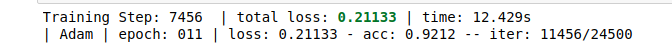
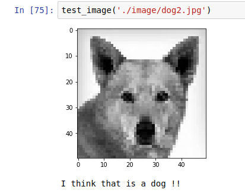
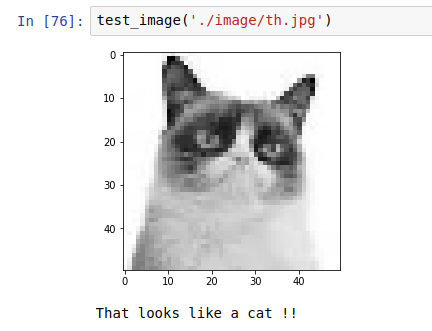
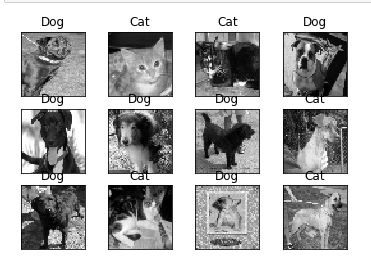

# Dog-or-Cat
A 6 Layer Convolutional Neural Network Implemented in TFLearn (Tensorflow Framework) to recognise cats and dogs .

Trained using Adam Optimizer and ReLU activation , it achieves a 92% accuracy in just 10 epochs !

**Some Stats ::**

## And some results ::
1. 
2. 
3. 

You may wish to re train the model or simply test your own image on the model I have already trained !

### To retrain ::
1. Clone the repo
2. Open the jupyter notebook
3. Restart the Kernel and run all

### To use your own image for testing purposes ::
1. Clone the repo
2. Open the jupyter notebook
3. Restart the Kernel and run all
4. Place your test image in the ./image directory
5. In a new cell in jupyter notebook , call the function test_image() passing the path of image as parameter
6. **Ofcourse ! Run that cell :)**

